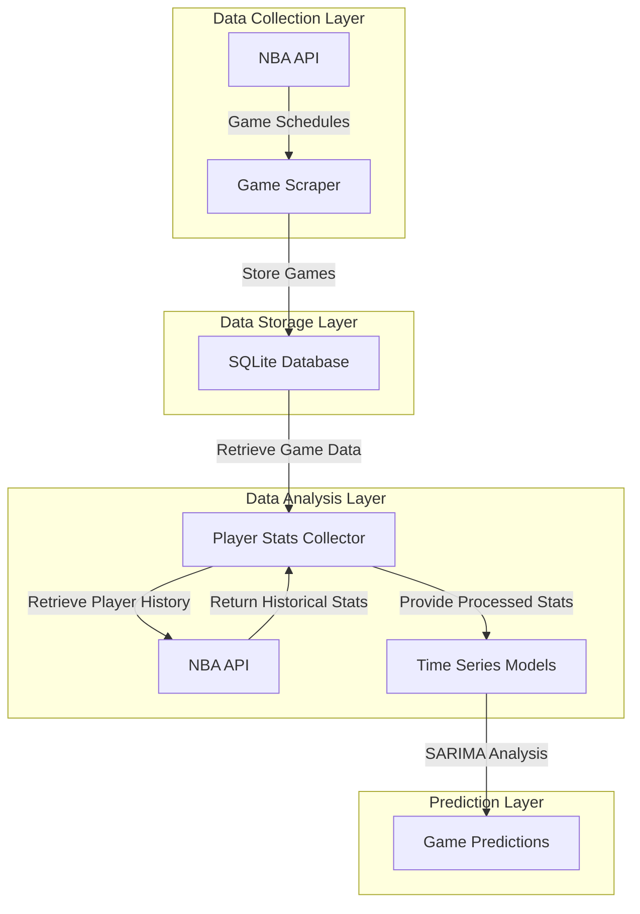

# Stat Lemon
Lead Developer: Calvin Luo

## Objective
StatLemon.app is an NBA analytics sandbox tool that uses SARIMA time series modeling to provide predictive insights for fantasy basketball players.

## Getting Started in 3 Minutes
1. Clone this repository
2. Install dependencies:
   ```
   pip install -r requirements.txt
   ```
3. Run the application:
   ```
   python app.py
   ```
4. Open your browser and navigate to `http://localhost:5000`

## Methodology


## Key Features
- Game schedule data from NBA API
- Player statistics collection and analysis
- SARIMA time series forecasting of player performance
- Player comparison tools
- Lineup builder with performance projections

## Technical Stack
- **Backend**: Python, Flask
- **Data Analysis**: numpy, pandas, statsmodels
- **Data Source**: NBA API
- **Storage**: SQLite
- **Frontend**: HTML, CSS, JavaScript, Chart.js

## API Endpoints
- `/api/today_games` - Get today's NBA games
- `/api/search_player` - Search for players by name
- `/api/player_stats/<player_name>` - Get player statistics
- `/api/player_prediction/<player_name>` - Get player performance predictions
- `/api/lineup_projection` - Project performance for a five-player lineup